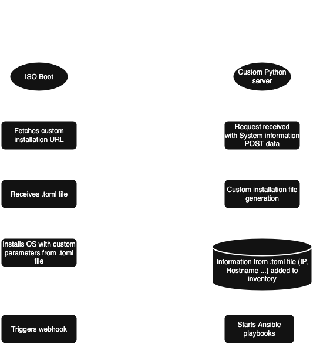

# 🧪 Proxmox Automated Installer Orchestrator

Automate Proxmox installation across multiple nodes using answer files, webhooks, and Ansible.

## 📁 Project Structure

```
prox_orchestrator/
│
├── app/                            # Core application logic
│   ├── __init__.py
│   ├── routes.py                   # Web routes for /webhook and /answer
│   ├── webhook_handler.py         # Handles post-installation webhook
│   ├── answer_handler.py          # Serves answer.toml to Proxmox ISO
│   ├── inventory.py               # Manages dynamic node inventory
│   ├── config.py                  # Loads TOML configuration
│   ├── utils.py                   # Common helper logic
│   ├── ansible_runner.py          # Launches Ansible playbook
│   └── constants.py               # Paths to files and directories
│
├── config.toml                    # Main config used for answer file generation
├── default.toml                   # Base answer.toml template
├── nodes/                         # One folder per node + dynamic inventory
│   └── dynamic-inventory.json
│
├── main.py                        # App entry point
├── requirements.txt               # Required Python packages
└── README.md                      # This file
```

## 🔄 How It Works

1. A custom Proxmox ISO fetches an `answer.toml` from a web endpoint (e.g. `/answer/`).
2. The orchestrator generates a machine-specific `answer.toml` using:
   - UUID
   - Requester IP
   - Predefined template (`default.toml`)
3. When Proxmox completes installation, it POSTs to `/webhook/` with system info.
4. The orchestrator logs the info and triggers an Ansible playbook if all nodes are ready.

## 🔧 Preparing the ISO for Auto-Install

### 📦 Install the tool ([official doc](https://pve.proxmox.com/wiki/Automated_Installation#Assistant_Tool))

```bash
apt update
apt install proxmox-auto-install-assistant xorriso
```

### 📁 Customizing the ISO

#### 🌐 Fetch answer file via HTTP(S)

```bash
proxmox-auto-install-assistant prepare-iso /path/to/proxmox.iso \
  --fetch-from http \
  --url "https://10.0.0.100/answer/" \
  --cert-fingerprint "XX:YY:ZZ:..."
```

> **Note**: You can optionally provide the fingerprint via DHCP or DNS TXT record (see [here](https://pve.proxmox.com/wiki/Automated_Installation#Answer_Fetched_via_HTTP)).

## 📬 HTTP Integration

### 🔸 Answer File Server

The orchestrator exposes:

- `/answer/` (POST): returns a tailored `answer.toml`
- `/webhook/` (POST): receives post-installation system details

### 📥 Sample POST to `/answer/`

```json
{
  "dmi": {
    "system": {
      "uuid": "F68D13F3-472B-4F1A-95A7-120B398A07AA"
    }
  }
}
```

### 📤 Sample POST from `/webhook/`

Sent automatically after Proxmox completes setup:

```json
{
  "fqdn": "node-aaaa.example.com",
  "filesystem": "ext4",
  "cpu-info": {
    "model": "Intel Xeon E5-2670"
  }
}
```

## 🚀 Automatic Ansible Playbook Execution

When all nodes are marked `"installed"` in `dynamic-inventory.json`, the orchestrator triggers:

```bash
ansible-playbook -i nodes/dynamic-inventory.json setup-cluster.yml
```

## 📋 Configuration

Here you can configure the main settings, that will be shared accross all the deployments. As of now, the IP address is set statically based on the first received IP address from the DHCP server upon boot. This behavior can be modified to use a dynamic ip address (see [here](https://pve.proxmox.com/wiki/Automated_Installation#Network_Section)).

### 🧩 `config.toml`

```toml
machine_template_name = "node-"
machine_net_dn = ".example.com"
machine_net_mask = "/24"
machine_net_dns = "10.0.0.1"
machine_net_gateway = "10.0.0.254"
machine_net_int = "Intel Corporation 82574L"
```

### 📁 `default.toml`

Used as a base for generating each node’s `answer.toml`. Must conform to [Proxmox answer file spec](https://pve.proxmox.com/wiki/Automated_Installation#Answer_File_Format_2).

## 🛡️ Security Tips

- Use HTTPS for answer file delivery (`/answer/`)
- Pin TLS certificate with `--cert-fingerprint`
- Use IP whitelisting or auth for sensitive endpoints

## 📦 Requirements

- Python 3.9+
- aiohttp
- tomlkit
- proxmox-auto-install-assistant
- xorriso (for ISO prep)

```bash
pip install aiohttp tomlkit
apt install proxmox-auto-install-assistant xorriso
```

## Action flow


## 🤝 Contributing

- Fork & PR welcome!
- Add support for parallel Ansible tasks or dashboard? Let's talk.

## 📜 License

[MIT](./LICENSE)
